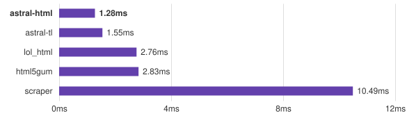

# astral-html

A high-performance HTML parser designed for document traversal.

astral-html provides a borrowed event reader and immutable document views. It implements HTML tokenization and recovery without browser tree construction, mutation, or serialization.

<p align="center">
  <picture align="center">
    <source media="(prefers-color-scheme: dark)" srcset="docs/assets/extraction-dark.svg">
    <source media="(prefers-color-scheme: light)" srcset="docs/assets/extraction-light.svg">
    
  </picture>
</p>

<p align="center">
  <i>Extracting 2,099 links from the PEP index with warm input on a shared AMD EPYC VM; astral-html uses Reader.
  <a href="https://github.com/viarius-experiments/astral-html/blob/7ea072add99590685672de232f2a3637baceeba2/benchmarks/results/README.md">Measurements and methodology</a>.</i>
</p>

```rust
use astral_html::Document;

let source = r#"<a href="/guide">Read the guide</a>"#;
let document = Document::parse(source)?;

for element in document.elements().filter(|element| element.is("a")) {
    if let Some(href) = element.attribute("href") {
        println!("{}: {}", element.text(), href.value());
    }
}
```

`Reader` selects HTML text modes automatically; `Tokenizer` accepts explicit context. `Document::parse_with_limits` bounds input bytes, nodes, nesting, and parsed attributes. Unchanged strings borrow from the input. The application chooses the allocator.

- [Conformance](docs/conformance.md): tokenizer and document semantics.
- [Resource limits](docs/safety.md): allocation and input bounds.
- [uv integration](docs/uv.md): compatibility tests and adapter.
- [Fuzzing](docs/fuzzing.md): targets, oracles, and commands.
- [Benchmarks](docs/performance.md): parsing and field extraction workloads.

The library is pre-release. Adoption in uv still requires its broader index and resolver integration tests.

## Development

```console
cargo test --workspace --all-targets --all-features --locked
cargo clippy --workspace --all-targets --all-features --locked -- -D warnings
cargo bench -p astral-html --bench parse --features benchmark-jemalloc --locked
```

CI tests AMD64 and ARM64 on Ubuntu 24.04 with the minimum supported Rust version and stable Rust. It also checks formatting, documentation, packaging, uv compatibility, and AddressSanitizer fuzz targets.

## License

astral-html is licensed under either of

- Apache License, Version 2.0, ([LICENSE-APACHE](LICENSE-APACHE) or
  <https://www.apache.org/licenses/LICENSE-2.0>)
- MIT license ([LICENSE-MIT](LICENSE-MIT) or <https://opensource.org/licenses/MIT>)

at your option.

Unless you explicitly state otherwise, any contribution intentionally submitted for inclusion in astral-html
by you, as defined in the Apache-2.0 license, shall be dually licensed as above, without any
additional terms or conditions.

<div align="center">
  <a target="_blank" href="https://astral.sh" style="background:none">
    
  </a>
</div>
